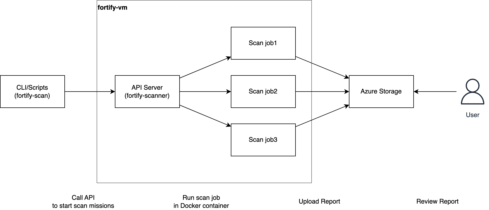

# Fortify-Runner

Fortify-Runner is a tool that automates the process of running Fortify scans on your codebase.



## Start Server

Update env variables and run server.

```bash
./start.sh
```

## Stop Server

Find the gunicorn process and kill it.

```
./stop.sh
```

## Trace Logs

The output log will be the same folder.

```
tail -f gunicorn.log
```

## API Call Examples

```bash
# healthcheck
curl -X GET http://fortify_host/ping

# run a test container
curl -X GET -u username:password http://fortify_host/test

# retrieve container log
curl -X GET -u username:password http://fortify_host/container/:id

# start a code scan job
curl -X POST -H "Content-Type: application/json" -d '{"repo_url":"<git_ssh_url>", "repo_name": "<git_repo_name>", "repo_type": "<python,golang,javascript>", "file_list": "<file_name>", "branch": "develop", "bypass_text": "Key Management: Hardcoded Encryption Key\nPassword Management: Hardcoded Password\n"}' -u username:password http://fortify_host/scan
```

## Specify Scan Files

You can specify the files to be scanned by creating a file list at the root folder of the repository. This file list should contain the paths to the files you want to scan. For example, you can create a file list called `fortify.cfg`:

```
./internal/pkg/api/server.go
./pkg/utils/tool1.go
./pkg/utils/tool2.go
./pkg/utils/tool3.go
```

Then, you can call the API with the `file_list` key and value. The key is optional, the files will be defined based on the `repo_type`.

```bash
curl -X POST -H "Content-Type: application/json" -d '{... "file_list": "fortify.cfg",...}' -u username:password http://fortify_host/scan
```

## Documents

- SCA User Guide: https://www.microfocus.com/documentation/fortify-static-code-analyzer-and-tools/2310/SCA_Guide_23.1.0.pdf
- SCA Applications and Tools Guide: https://www.microfocus.com/documentation/fortify-static-code-analyzer-and-tools/2310/SCA_Apps_Tools_23.1.0.pdf
